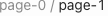
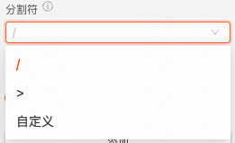
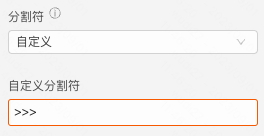
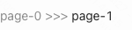
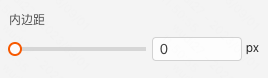
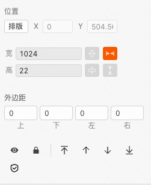

```
应用场景
场景1：电商商品详情页上展示商品所在分类
场景2：中后台页面展示当前页面所在路径

```

Demo地址：[【面包屑】基础使用](https://my.mybricks.world/mybricks-app-pcspa/index.html?id=473912382144581)

----

## 基本操作
### 分割符






说明：用于配置面包屑每一项之间的分割符

### 内边距



说明：用于控制内边距

### 添加


说明：点击添加，增加面包屑数量

----
## 逻辑编排
----

## 样式
### 通用组件样式


说明：默认为自定义，可以选择提前预制好的风格样式作为组件的兜底样式


