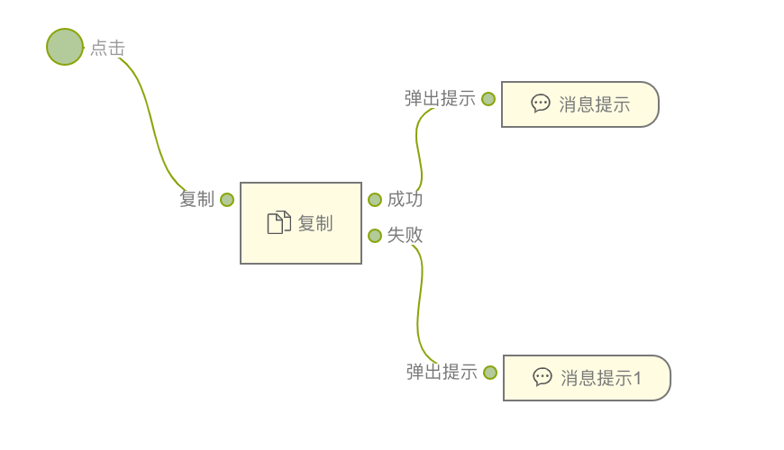
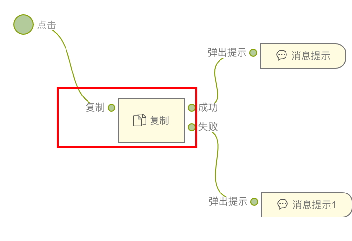
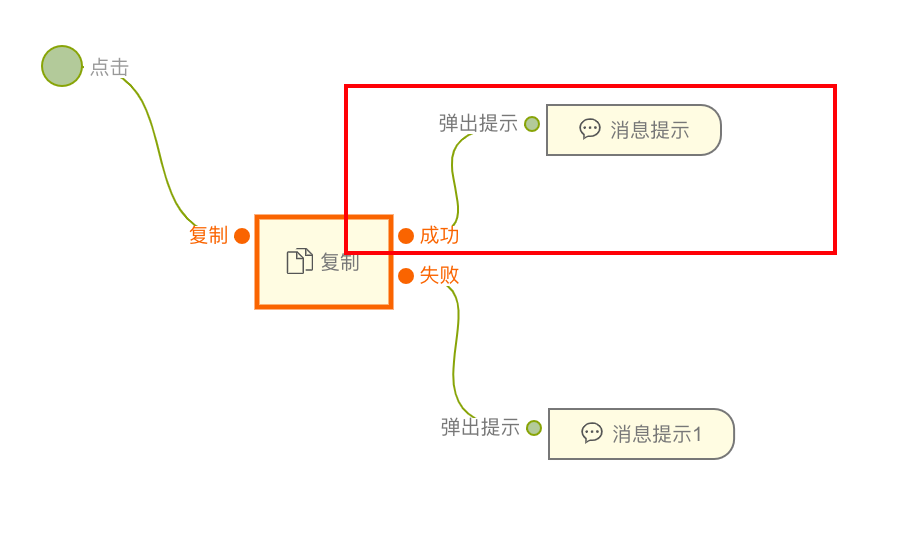
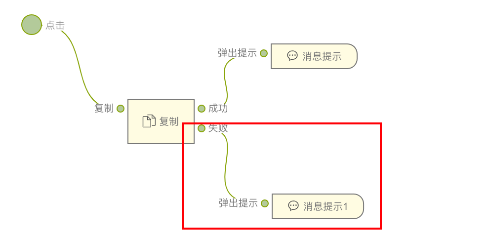

> **应用场景1**：分享功能：当用户想要分享某个文本、链接或代码片段时，可以使用复制组件将内容复制到剪贴板，然后粘贴到其他应用程序或聊天工具中，以便分享。\
**应用场景2**：配置复制：如果应用程序涉及到一些需要用户手动复制的配置信息，例如地址、商品名， API 密钥、URL 地址或其他设置，复制组件可以提供一种简便的方式，让用户通过点击按钮即可将这些配置信息复制到剪贴板，避免了手动复制和可能出现的错误。\
**应用场景3**：表单输入：在某些情况下，可能会有一些需要用户手动复制的表单输入，例如邀请码或短链接。通过使用复制组件，可以让用户更轻松地将这些值复制到剪贴板上，以便在其他地方进行粘贴操作，提供了更好的用户体验。\

> **注**：逻辑组件，可以在连线后的逻辑组件中找到

Demo地址：[【复制】基本使用](https://my.mybricks.world/mybricks-app-pcspa/index.html?id=476168305721413)

----
## 基本操作
### 复制

----
## 逻辑编排
### 复制
连线到复制组件，会将传入的数据复制到用户的剪贴板，如果传入的不是字符，会返回转换成字符后的数据，如果不能转换将返回失败

### 复制成功
复制成功触发后续操作，输出值为复制的内容

### 复制失败
复制失败触发后续操作，输出为失败原因

----

## 样式
暂无