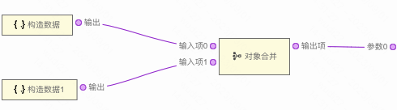
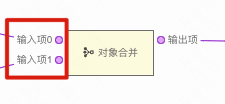
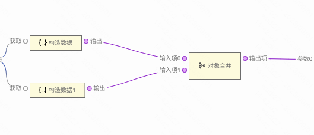

```
应用场景1：查询表格，在搜索数据时，需要将表格的分页数据和搜索表单的表单值合并起来一起给到后端接口
应用场景2：描述列表里的数据来自多个接口，在多个接口请求完成后，可以通过对象合并来将接口返回值合并，再把合并后的数据给到描述列表
注：逻辑组件，可以在连线中的逻辑组件中找到
```

Demo地址:[【对象合并】基本使用](https://my.mybricks.world/mybricks-pc-page/index.html?id=473923609673797)

----

## 基本操作
### 添加输入项




说明：输入项默认只有一个，可以根据需求来添加输入项

----

## 逻辑编排
### 对象合并


多个连入的输入项会合并成一个输出项输出

----

## 样式
### 默认样式
无