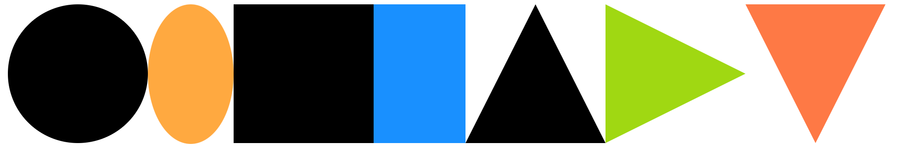
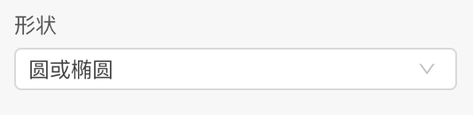
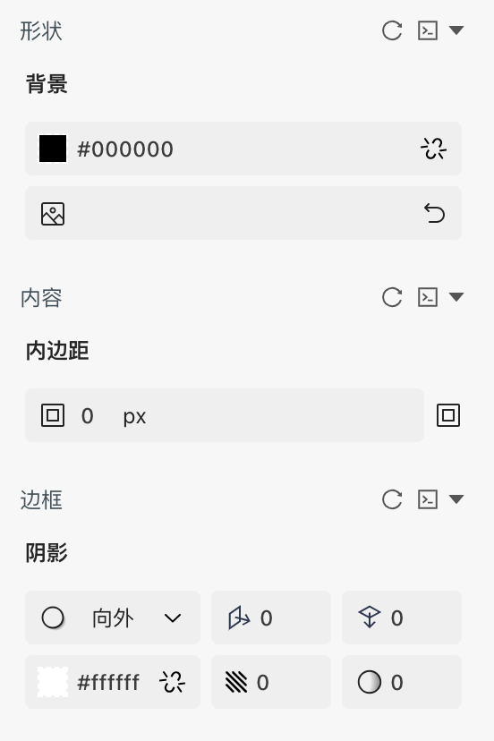
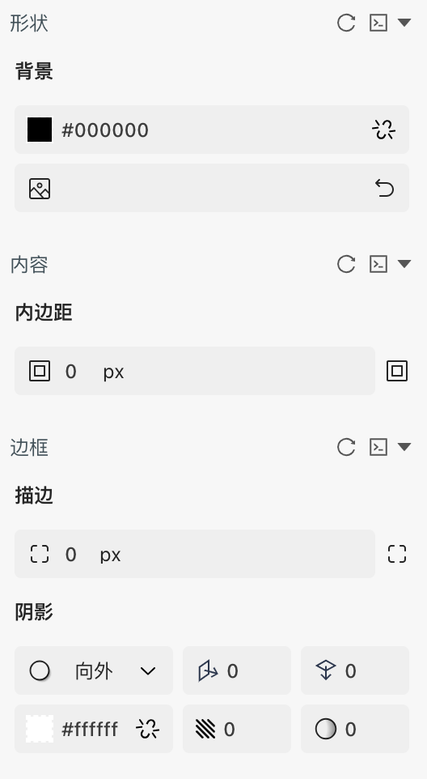
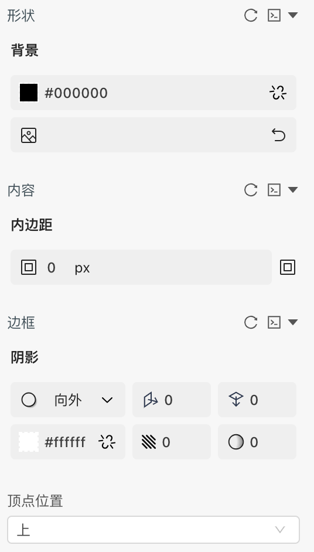

```
应用场景：展示基础图形
```
Demo地址：[【形状】基本使用](https://my.mybricks.world/mybricks-pc-page/index.html?id=470821274214469)


----
## 基本操作
### 形状
#### 形状
目前支持圆、矩形、三角形



----

## 逻辑编排

----

## 样式
### 默认样式
#### 圆形


#### 矩形


#### 三角形
