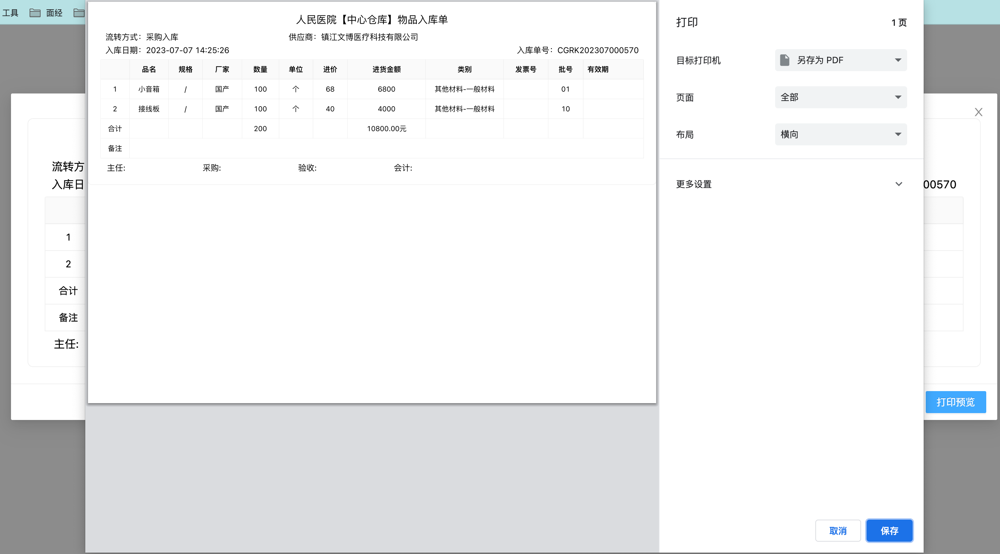
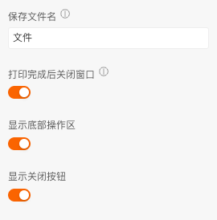
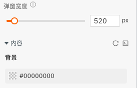

```
应用场景：需要进行打印的情形，如发票、表格等
```
Demo地址：[【打印对话框】基本使用](https://my.mybricks.world/mybricks-pc-page/index.html?id=477865893630021)

----

## 基本操作
### 保存文件名
设置保存的文件文件名

### 打印完成后关闭窗口
打印完成后是否关闭打印对话框

### 显示底部操作区
控制底部操作区的显示，隐藏后可以通过打印组件的开始打印控制打印

### 显示关闭按钮
控制右上角关闭按钮的显示



----
## 逻辑编排
### 开始打印
控制打印，立即打印


### 打印预览
点击开始打印


----

## 样式
弹窗宽度和内容背景，其中宽度默认520px,设置为0也展示520px


