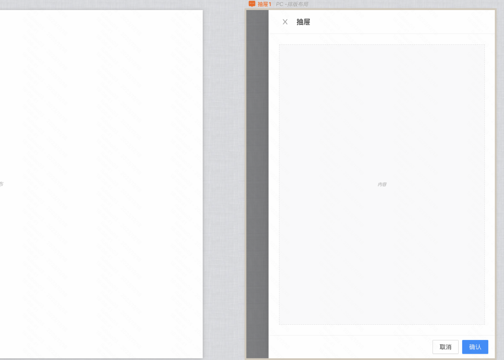
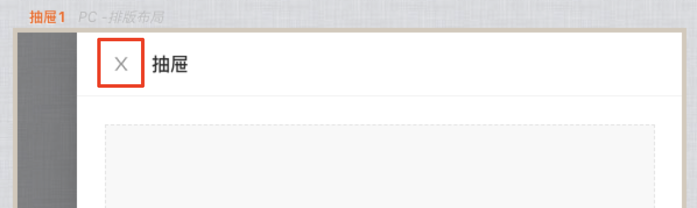
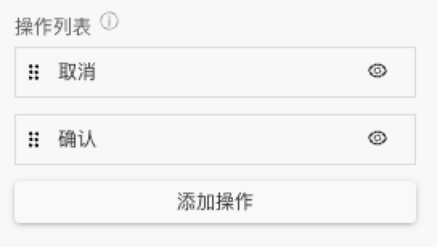
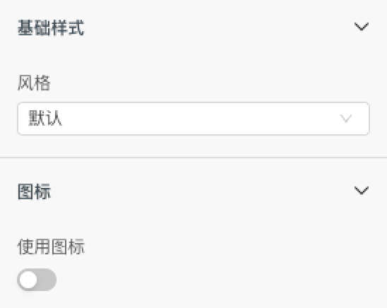
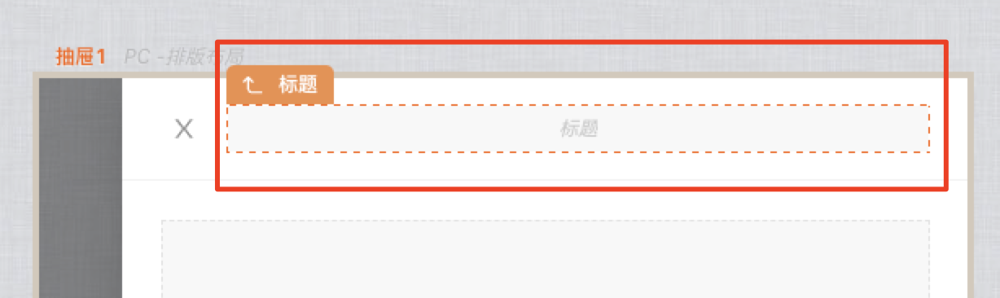
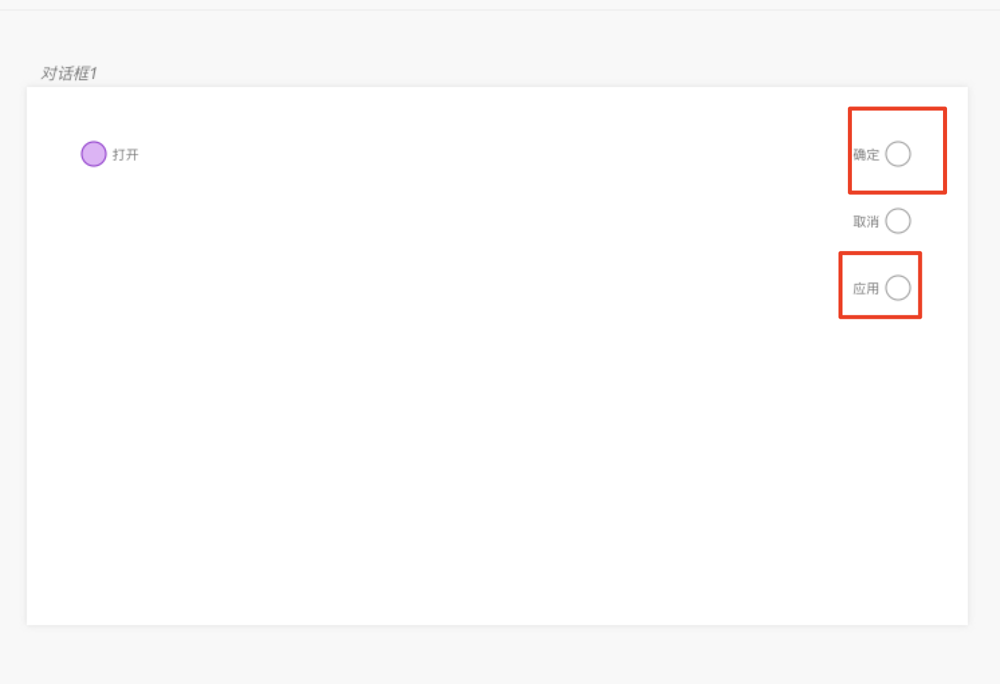
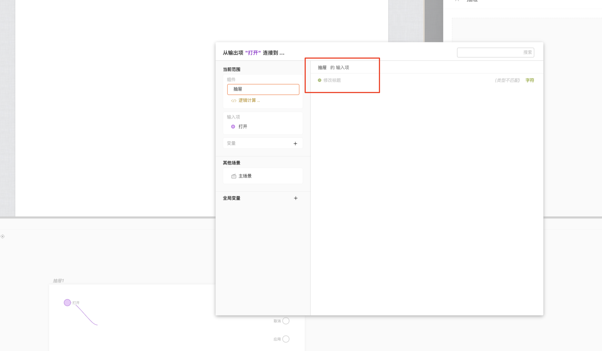
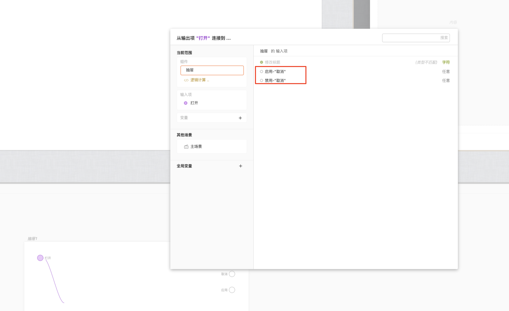
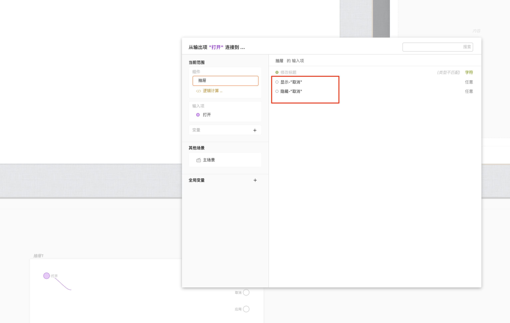
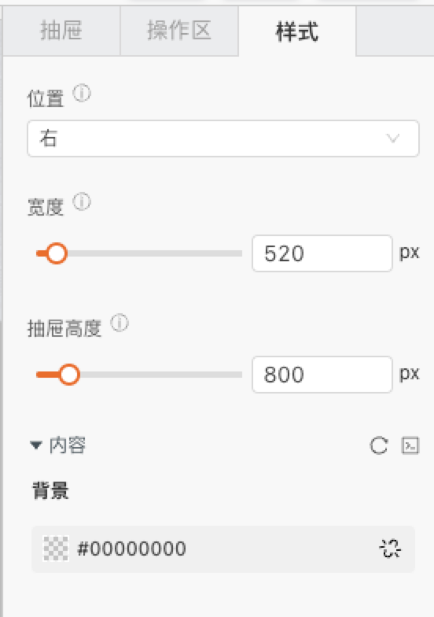

> **背景**\
> 1）多场景能够极大简化页面搭建复杂度，原先在页面中如果存在多个对话框，会导致页面搭建十分复杂。同时也解决了对话框内搭建时UI与交互来回切换繁琐的体验问题\
> 2）在原单画布的基础上，增加了多场景画布，聚焦到场景画布上可对该场景进行单独调试

> **应用场景**\
> 场景1：弹出层展示对应信息，比如表单当前行数据，确认信息等。\
> 场景2：多个弹出层，嵌套调用。

demo：[【抽屉】基础使用](https://my.mybricks.world/mybricks-app-pcspa/index.html?id=478163514458181)

----

## 基本操作
### 抽屉
#### 标题

#### 隐藏标题

开启后，可以隐藏标题
#### 关闭按钮

默认打开，关闭后，【关闭按钮】消失

#### 点击蒙层关闭

默认开启，点击页面蒙层可以关闭对话框。关闭后，点击蒙层不关闭。
### 操作区
#### 显示

默认开启，显示操作区。关闭后，操作区隐藏。
#### 对齐方式

#### 操作列表

点击“添加操作”，可以增加操作项，点击对应隐藏图标，可以切换操作项显示隐藏。
### 按钮子项
#### 显示

#### 名称

#### 基础样式

#### 点击自动关闭抽屉

当按钮类型为，取消时，有“点击自动关闭抽屉”开关，默认打开。即当点击抽屉取消按钮时，可以自动关闭抽屉，开启后，需要在作用域卡片连线关闭抽屉。

### 标题
#### 内容

#### 自定义

开启后，可以自定义，抽屉标题内容

#### 关闭按钮

关闭后，不显示关闭按钮
## 逻辑编排
### 作用域卡片
#### 1、确定和应用的区别

应用的语义是向外派发消息但不关闭popup；

确认，是指关闭popup时，从打开popup位置的【确认】关联输出项，向外派发数据；

前提是数据传递的链路是通的。
#### 2、确定输出，连接和不连接的区别

1）不连接时，点击确定按钮无法关闭对话框；连接时，链路通时，可以点击关闭对话框；

2）不连接时，其他场景调用时，无关联输出；连接时，有对应关联输出。

demo：[4-2多场景对话框-确定输出是否连线的区别](https://docs.qingque.cn/d/home/eZQDq1yt5jDHu1RTfk4eU8Fjl?identityId=20b8F4mmCiS)

注：这里的逻辑和对话框一样
### 数据传递

[4-3多场景对话框-数据输入与数据跨场景输出](https://docs.qingque.cn/d/home/eZQCyYAUW7-fDl-1e2l3JmjmP?identityId=20b8F4mmCiS)

注：这里的逻辑和对话框一样
### 修改标题

### 操作项
#### 1、动态启用/禁用

> 开启启用/禁用开关

#### 2、动态启用/禁用

> 开启显示隐藏

 **样式** 
### 抽屉样式

