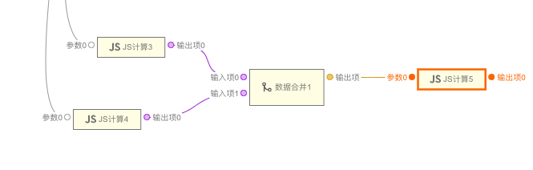
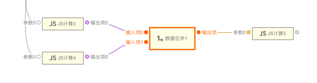
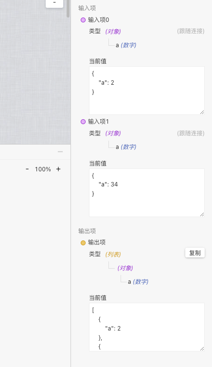

> **应用场景 1**：将多个数据按顺序合并成一个新数组

> **注**：逻辑组件，可以在连线中的逻辑组件中找到

Demo 地址:[【数据合并】基本使用](https://my.mybricks.world/mybricks-pc-page/index.html?id=514594421755973)

---

## 基本操作

### 添加输入项

添加输入,输入项会按照顺序合成新数组

说明：输入项默认有两个，可以根据需求来添加删减输入项

---

## 逻辑编排

### 对象合并

多个连入的输入项会按照顺序合并成一个新数组输出

配置好输入项的 schema 后,可以查看输出项的 schema 来看生成的数据结构

---

## 样式

### 默认样式

无
