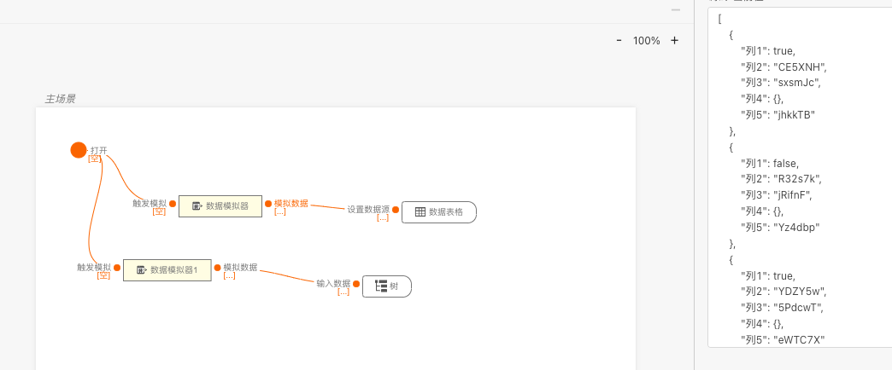
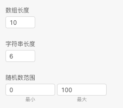
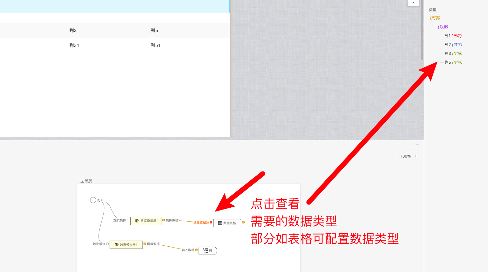

> 应用场景 1：原型开发和演示：在开发的早期阶段，当后端接口还未完全实现时，使用数据模拟器可以生成模拟数据，使开发人员能够快速构建原型和演示页面功能。这样可以减少对后端依赖，并在早期阶段验证前端设计和用户交互。\
> 应用场景 2：前端测试，数据模拟器可以生成测试数据，以模拟不同的用户场景和交互情况。这有助于测试前端代码的功能、性能和兼容性，发现和排除潜在的问题和错误。\
> 注：逻辑组件，可以在连线后的逻辑组件中找到

Demo 地址：[【数据模拟器】基本使用](https://my.mybricks.world/mybricks-app-pcspa/index.html?id=476176846057541)

## 基本操作

### 数据模拟器

#### 配置部分数据类型

数组长度(个数),字符串长度,数字的最大值最小值

## 逻辑编排

### 模拟数据

连线后根据后续需要的数据格式生成数据

## 样式

暂无
