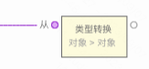
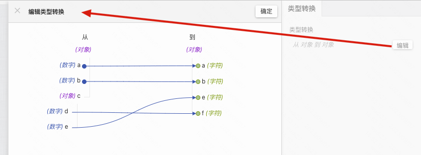

> **应用场景**：接口返回的数据格式不符合需求，需要做一些转换时使用\

> **注**：逻辑组件，可以在连线中的逻辑组件中找到

Demo地址：[【类型转换】基本使用](https://my.mybricks.world/mybricks-app-pcspa/index.html?id=476086448853061)

----

## 基本操作
无

## 逻辑编排
### 类型转换

说明：
1. 选中类型转换节点后，右侧面板会出现类型转换的配置项
2. 点击编辑出现编辑类型转换面板
3. 编辑类型转换面板中可以通过连线的方式进行类型转换
tip：连线是从右往左连的，鼠标先移到右侧某一字段，然后拖拽到左侧对应字段上

----
## 样式
### 默认样式
无
